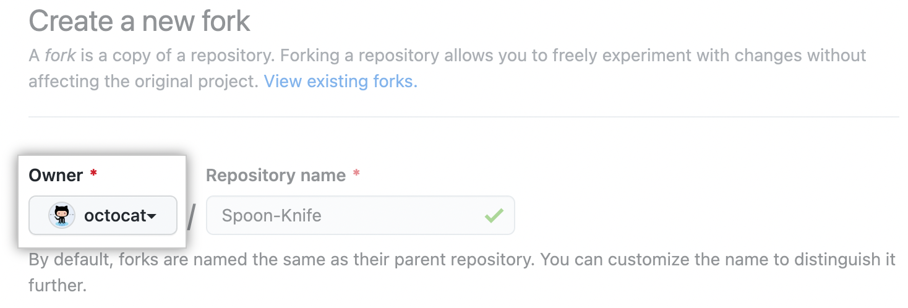
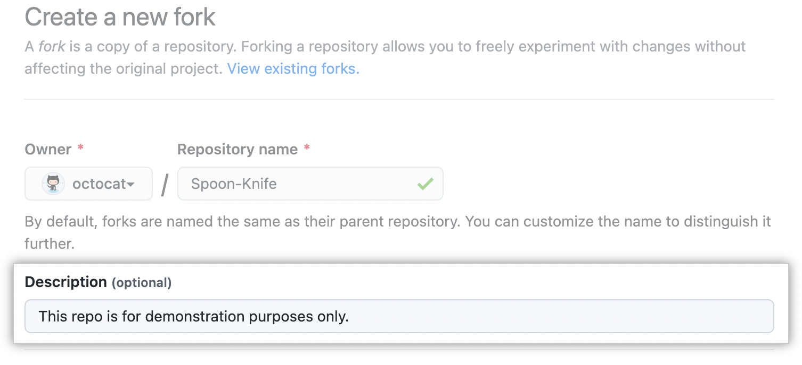
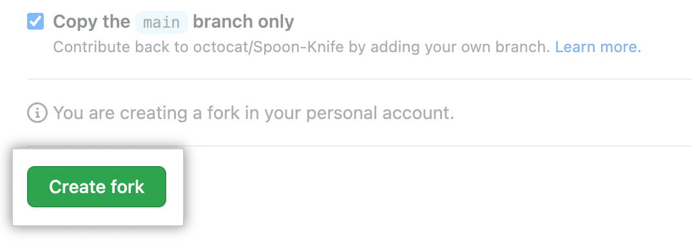
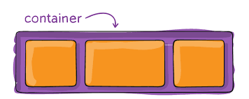
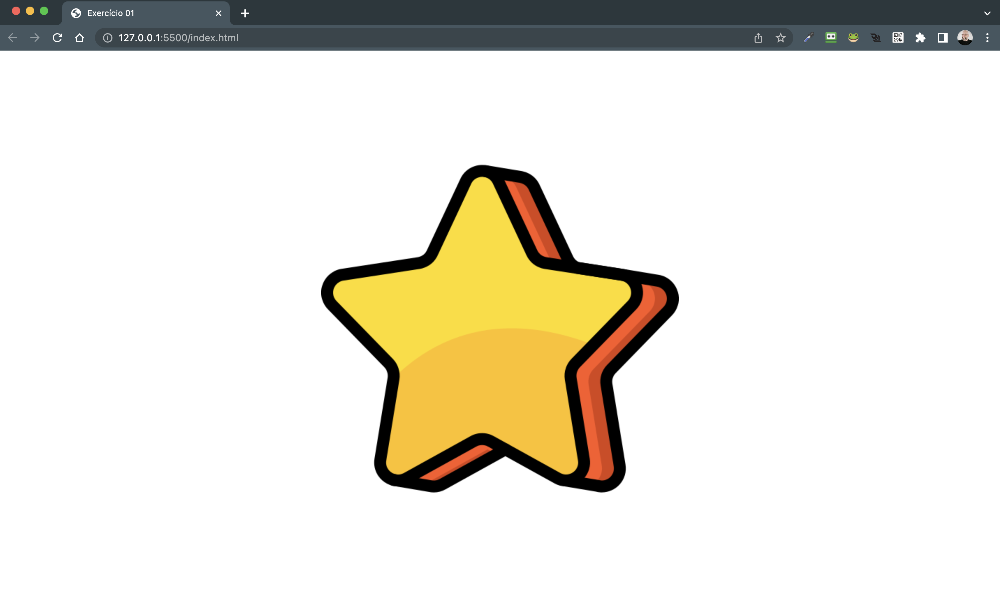

# Desafios para treinar posicionamentos de elementos em tela...
Utilizaremos flexbox: `display: flex... align-items, justify-content, etc...`

## Orientações

<details>
  <summary><strong>‼️ Antes de começar a desenvolver</strong></summary><br/>
    ⚠️ Crie um fork desse projeto, para isso siga esse passo a passo.
    <br><br>
    1- Clique em Criar Fork.<br>
    <br>

    2- Selecione um proprietário para o repositório bifurcado.<br>
    <br>

    3- Por padrão, os forks são nomeados da mesma forma que os respectivos repositórios pai. Você pode alterar o nome da bifurcação para distingui-la ainda mais.<br>
    <br>

    4- Como opção, adicione uma descrição da bifurcação.<br>
    <br>

    5- Escolha se deseja copiar apenas o branch padrão ou todos os branches para a nova bifurcação. Para muitos cenários de bifurcação, como contribuir para projetos de código aberto, você só precisa copiar o branch padrão. Por padrão, somente o branch padrão é copiado.<br>
    <br>

    6- Clique em Criar bifurcação.<br>
    <br>

</details> <br>

<details>
  <summary><strong>Colinha de `positions` para ajudar 😎</strong></summary><br/>

  ### Colinha de `positions` para ajudar 😎
<br><br>

### Dica, lembre-se que ara alinhar usamos `containers` ex; `<section>, <div>, <aside> etc...` 💡
<br><br>

### Ahhh, só  mais essa, vc se lembra que temos a propriedade `flex-direction` né? 🤔
<br><br>


</details>

<br> Teremos várias branches de exercícios ex: `exercicio X` e também as branches de gabarito ex: `exercicio X - resolução`. Faça os exercícios na branch correspondente, ex: `exercicio X` e se precisar navegue até a branch de gabarito ex: `exercicio X - resolução` se precisar de ajuda.


<h1><br>
<p align="center">
🚀 Comando báicos marotos do Github para te lembrar
</p>
</h1>

```bash
# Verificar o status de seu desenvolvimento
git status

# Adicionar os arquivos feitos/modificados na stage area
git add . "ou" git add <nome-do-arquivo>

# Inserindo uma mensagem "sobre as mudanças"
git commit -m "mensagem do meu commit"

# Enviando meus arquivos para o github
git push
```

## Exercício 1 - Centralize uma elemento/imagem na tela
Seu desafio aqui é centralizar a imagem que esta na pasta `img_ex1` na tela da aplicação.<br><br>
O resultado que espero de você.<br>
